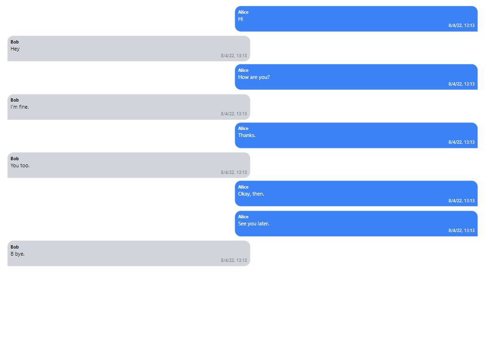

# wa_reader
Parse WhatApps exported message into visualized way.

This allows you to upload a WhatsApp chat log and view its contents. You can only upload a `txt` directly  file containing the exported chat.

## Purpose
The purpose of this project is to see your WhatApps messages, instead of scrolling a lot, you can directly reach ot certain message with ease. even on specific date.
- Past exists now.
- > The past saved in a series of snapshots. Whenever we look at it, we remember the past and it changes our emotions. Past is a big mystery. [reference](https://www.lablnet.com/quotes)

 
## Features
1. [x] Visualized your Personal or group chat.
2. [ ] Pagination
3. [ ] Filter message by date (month, day)
4. [ ] Searching

### Techonology Stack
1. [TailwindCSS](https://tailwindcss.com/).
2. [sweetalert2](https://sweetalert2.github.io/)

## Contributing

Thank you for considering contributing to the this project! Feel free to create a pull request.

###  Contrubuting guide

[Contribution Guidelines](https://github.com/lablnet/wa_reader/blob/main/CONTRIBUTING.md)

## License
- MIT
